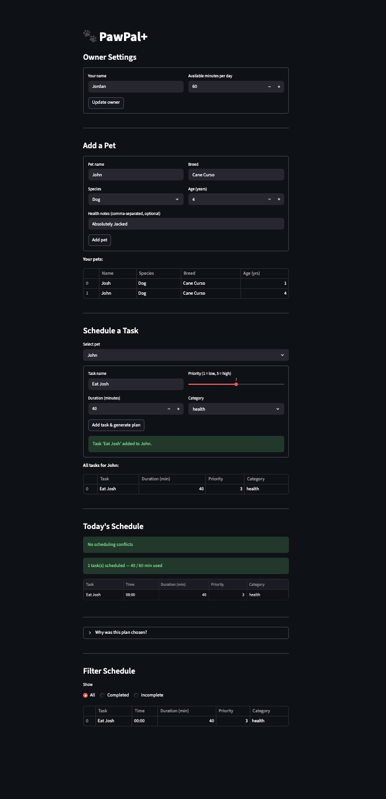

# PawPal+ (Module 2 Project)

You are building **PawPal+**, a Streamlit app that helps a pet owner plan care tasks for their pet.

## Scenario

A busy pet owner needs help staying consistent with pet care. They want an assistant that can:

- Track pet care tasks (walks, feeding, meds, enrichment, grooming, etc.)
- Consider constraints (time available, priority, owner preferences)
- Produce a daily plan and explain why it chose that plan

Your job is to design the system first (UML), then implement the logic in Python, then connect it to the Streamlit UI.

## What you will build

Your final app should:

- Let a user enter basic owner + pet info
- Let a user add/edit tasks (duration + priority at minimum)
- Generate a daily schedule/plan based on constraints and priorities
- Display the plan clearly (and ideally explain the reasoning)
- Include tests for the most important scheduling behaviors

## Getting started

### Setup

```bash
source .venv/bin/activate  # Windows: .venv\Scripts\activate
pip install -r requirements.txt
```

### Suggested workflow

1. Read the scenario carefully and identify requirements and edge cases.
2. Draft a UML diagram (classes, attributes, methods, relationships).
3. Convert UML into Python class stubs (no logic yet).
4. Implement scheduling logic in small increments.
5. Add tests to verify key behaviors.
6. Connect your logic to the Streamlit UI in `app.py`.
7. Refine UML so it matches what you actually built.

## Smarter Scheduling

PawPal+ includes a bunch of features that automate scheduling to make it intelligent rather than manual and laborous:

- **Sorted Schedules** — tasks are automatically sorted chronologically 
  by time so owners always see their day in order
- **Smart Filtering** — tasks can be filtered by completion status or 
  pet name to focus on what still needs to be done
- **Recurring Tasks** — daily and weekly tasks automatically reschedule 
  themselves after being marked complete, so nothing falls through 
  the cracks
- **Conflict Detection** — the scheduler warns owners when two tasks 
  are booked at the same time, for the same pet or across pets, 
  without crashing the app
- **Time-Constrained Planning** — the scheduler only includes tasks
  that fit within the owner's available daily minutes, and explains
  which tasks were excluded and why

### Priority-Based Scheduling (Challenge 3)

PawPal+ supports three priority tiers, each with a distinct emoji indicator:

- **🔴 High** — tasks with priority ≥ 4 (urgent care, medications, vet visits)
- **🟡 Medium** — tasks with priority = 3 (regular enrichment, grooming sessions)
- **🟢 Low** — tasks with priority ≤ 2 (optional activities, low-urgency maintenance)

**How `sort_by_priority_then_time()` works:** The method sorts the current scheduled tasks using a two-key tuple — first by priority descending (so the most critical tasks always appear at the top), then by time ascending to break ties chronologically. If two tasks share the same priority level, the one scheduled earlier in the day appears first. This ensures that when an owner scans the schedule, the most important tasks are immediately visible at the top, while time ordering still makes the day readable.

**Why priority takes precedence over time:** A pet owner's first concern is whether the critical tasks (medications, vet checkups) will get done — not what time they happen. Surfacing high-priority tasks at the top of the list reduces the chance that an urgent task gets missed because it was buried below a low-priority item scheduled earlier in the day.

**Inline Chat and emoji color-coding:** The `priority_label` property on `Task` was highlighted in the editor and Inline Chat was asked to extend the Streamlit display logic to prefix each task name with the matching emoji from `priority_label`. Inline Chat generated the `t.priority_label.split()[0] + " " + t.name` expression used in the dataframe, which extracts just the emoji character from the label string and prepends it to the task name for a consistent color-coded row appearance.

### Weighted Prioritization (Agent Mode)

Raw priority alone can produce a misleading schedule: a high-priority one-time task due two weeks from now will always beat a low-priority daily task that is due today, even though missing the daily task has compounding consequences. Weighted prioritization solves this by computing a composite score for each task before ranking, so urgency and recurrence are quantified alongside importance.

**Scoring factors:**

| Factor | Weight | Logic |
|---|---|---|
| Priority | 40% | Normalized against the highest priority in the current task pool |
| Duration efficiency | 30% | Shorter tasks score higher, maximising the number of tasks that fit within the time budget |
| Recurrence urgency | 20% | Daily → 1.0, weekly → 0.5, one-time → 0.0 |
| Due-date proximity | 10% | Overdue or due today → 1.0; decays linearly to 0.0 at 30 days out |

**How Agent Mode was used:**

This feature was implemented by providing Agent Mode with the existing `Scheduler` structure, the four scoring factors and their percentage weights, and the constraint that no existing method signatures could be modified. Agent Mode planned the changes across three methods — `score_task()`, `generate_weighted_plan()`, and `explain_weighted_plan()` — and identified that the composite score must normalize against the live task pool to remain relative, requiring the pool to be re-derived inside each `score_task()` call rather than cached at plan-generation time.

**Concrete example:**

| Task | Raw priority | Weighted score | Why |
|---|---|---|---|
| Vet Checkup (once, due in 14 days, 60 min) | **5** — ranked 1st | 0.453 — ranked 3rd | Long duration zeroes out efficiency; one-time and future due-date both score low |
| Weekly Grooming (weekly, due in 7 days, 30 min) | 3 — ranked 2nd | 0.567 — ranked 2nd | Medium score across all four factors |
| Daily Walk (daily, due today, 20 min) | 2 — ranked 3rd | **0.660 — ranked 1st** | Short duration + daily recurrence + due today combine to outweigh the lower raw priority |

## 💾 Data Persistence

PawPal+ automatically saves and restores all owner, pet, and task data between sessions using a local JSON file (`data.json`).

- **`Owner.to_dict()` / `Owner.from_dict()`** — serialize and deserialize the entire owner graph (owner → pets → tasks) to and from a plain Python dictionary.
- **`Owner.save_to_json(filepath)`** — writes the serialized owner data to `data.json` after every form submission, task completion toggle, and owner-settings update.
- **`Owner.load_from_json(filepath)`** — reads `data.json` on app startup; if the file is missing or corrupted, returns a default owner so the app never crashes on first launch.
- **Session continuity** — `app.py` calls `Owner.load_from_json()` inside the `st.session_state` guard so the data is loaded exactly once per browser session and persists across all Streamlit reruns without being reset by widget interactions.

> `data.json` is excluded from version control via `.gitignore` because it contains personal pet and scheduling data that is machine-specific.

## Testing PawPal+

The test suite uses pytest with real instantiated objects from `pawpal_system.py` so every test exercises the actual scheduling logic end to end.

### Running the tests

```bash
python -m pytest
```

### What is covered

- **Sorting order** — No matter what order the tasks are added, the system will automatically organize them chronologically so the schedule makes sense.
- **Handling repeating chores** — Once a daily or weekly task is completed, the app automatically creates the next occurence of it at the correct time.
- **Schedule Clashes** — If two tasks are scheduled on accident for the exact same time, the app will warn you to avoid that or allow you to address it.
- **Edge cases** — Ensures app doesn't crash with empty cariables. Empty task lists produce an empty plan without raising an exception; unknown task names return a warning string; a time budget smaller than the shortest task yields an empty plan; one-time tasks do not generate a new occurrence after completion.

- **Confidence Level** - 5/5 Stars. Based on my test results, I am very confident in the system's reliability.

## ✨ Features

- **Priority-Based Scheduling** — `generate_plan()` sorts all non-completed tasks by priority descending, then greedily adds each task to the daily plan only if its duration fits within the remaining time budget.
- **Time-Constrained Planning** — `owner.available_minutes_per_day` acts as a hard cap; a task is excluded from the plan the moment adding it would cause cumulative scheduled minutes to exceed that limit.
- **Sorting by Time** — `sort_by_time()` returns a new list of the current scheduled tasks ordered chronologically by their `time` attribute without mutating the original `scheduled_tasks` list.
- **Filtering by Status** — `filter_by_status(is_completed)` returns only the scheduled tasks whose completion flag matches the requested state, letting owners focus on what still needs doing.
- **Filtering by Pet** — `filter_by_pet(pet_name)` returns scheduled tasks that belong to a specific pet by name (case-insensitive), useful when an owner manages multiple pets with overlapping schedules.
- **Daily Recurrence** — when a daily task is marked complete via `mark_task_complete()`, a fresh copy with `is_completed=False` and `due_date` advanced by one day is automatically appended to the pet's task list.
- **Weekly Recurrence** — when a weekly task is marked complete, the same copy mechanism runs but advances `due_date` by seven days, ensuring the next occurrence appears in future plans without manual re-entry.
- **Conflict Detection** — `detect_conflicts()` groups scheduled tasks by their `time` string and returns a formatted warning listing every time slot that has more than one task, or `None` if no conflicts exist, so the owner is informed without the app raising an exception.
- **Plan Explanation** — `explain_plan()` produces a human-readable summary of included tasks (ordered by priority), tasks skipped due to insufficient remaining time, and tasks already completed, so the owner understands exactly why each task was included or excluded.
- **Persistent UI State** — `st.session_state` stores the `owner`, `current_pet`, and `scheduler` objects across every Streamlit rerun, so pets, tasks, and the active plan survive all widget interactions without being reset.

## 🎨 UI and Output Formatting (Challenge 4)

### Emoji Category System

Every `Task` now exposes two read-only properties that add visual context without modifying any stored data:

- **`category_emoji`** — maps the task's `category` string to a matching emoji: `exercise` → 🏃, `nutrition` → 🍖, `health` → 💊, `hygiene` → 🛁, `enrichment` → 🧸, `grooming` → ✂️, `other` / unrecognized → 📋. The mapping lives in a single dict lookup so adding new categories requires only one line.
- **`display_name`** — returns `category_emoji + " " + name`, e.g. `"🏃 Morning Walk"`. Used in every table and checklist so tasks are immediately recognisable at a glance.

Both are `@property` decorators with a one-line docstring and do not modify any stored `Task` attributes.

A third property, **`priority_label`**, replaces the plain integer with a color-coded emoji label: 🔴 Critical (5), 🟠 High (4), 🟡 Medium (3), 🟢 Low (2), ⚪ Minimal (1).

### Tabulate CLI Tables

`main.py` imports `tabulate` and replaces every raw print loop with a `tabulate(..., tablefmt="rounded_outline")` call. Each schedule table contains seven columns:

| Column | Source |
|---|---|
| Task | `task.display_name` |
| Category | `task.category` |
| Duration (min) | `task.duration_minutes` |
| Priority | `task.priority_label` |
| Time | `task.time` |
| Due Date | `task.next_occurrence()` or `"One-time"` |
| Status | `"✅ Done"` or `"⏳ Pending"` |

Conflict detection is rendered as a clearly bordered warning block with a `⚠️ SCHEDULING CONFLICTS DETECTED` header and indented conflict lines. Every section is separated by a `─` divider spanning 60 characters.

The weighted prioritisation demo shows the raw-priority plan and the weighted plan in back-to-back tables so the rank reversal is immediately visible.

### Streamlit Sidebar Summary Panel

A persistent `📊 Daily Summary` sidebar panel appears on every page. It shows:
- Owner name and daily time budget
- Total pets registered and total tasks across all pets
- Count of completed vs pending tasks for the current schedule
- A `st.progress()` bar showing the percentage of today's scheduled tasks that have been marked done (e.g. `2/5 tasks done`)

### Completion Progress Bar and Status Banners

Three contextual banners appear at the top of the schedule section:
- `st.success()` — displayed when every scheduled task has been marked complete
- `st.warning()` — displayed when any high-priority task (priority ≥ 4) is still pending
- `st.error()` — displayed only when a scheduling conflict exists

Each task row in the schedule includes a `st.checkbox()` wired to an `on_change` callback. Checking or unchecking a box calls `scheduler.mark_task_complete()` (or `task.reset()`), saves state via `owner.save_to_json()`, regenerates the plan, and triggers a Streamlit rerun — all without a browser page reload.

### How Inline Chat Was Used

The category-to-emoji mapping was built with Inline Chat: the list of category strings in `pawpal_system.py` was highlighted and Inline Chat was asked to map each category to a thematically matching emoji and integrate the result into a `@property` that falls back to 📋 for any unrecognized value. The same session extended the approach to add the `display_name` property and wire both properties into the `tabulate` row builder in `main.py` and the Streamlit checklist in `app.py`, ensuring the color-coded status indicators (`✅ Done` / `⏳ Pending`) appeared consistently across both interfaces.

## 📸 Demo

<a href="Pawpal_screenshot.png" target="_blank">
  
</a>