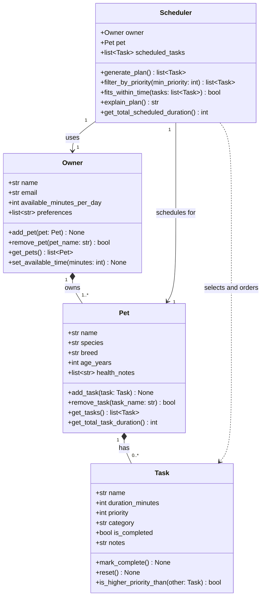

# PawPal+ UML Class Diagram

```mermaid
classDiagram
    class Owner {
        +str name
        +str email
        +int available_minutes_per_day
        +list~str~ preferences
        +add_pet(pet: Pet) None
        +remove_pet(pet_name: str) bool
        +get_pets() list~Pet~
        +set_available_time(minutes: int) None
    }

    class Pet {
        +str name
        +str species
        +str breed
        +int age_years
        +list~str~ health_notes
        +add_task(task: Task) None
        +remove_task(task_name: str) bool
        +get_tasks() list~Task~
        +get_total_task_duration() int
    }

    class Task {
        +str name
        +int duration_minutes
        +int priority
        +str category
        +bool is_completed
        +str notes
        +mark_complete() None
        +reset() None
        +is_higher_priority_than(other: Task) bool
    }

    class Scheduler {
        +Owner owner
        +Pet pet
        +list~Task~ scheduled_tasks
        +generate_plan() list~Task~
        +filter_by_priority(min_priority: int) list~Task~
        +fits_within_time(tasks: list~Task~) bool
        +explain_plan() str
        +get_total_scheduled_duration() int
    }

    Owner "1" *-- "1..*" Pet : owns
    Pet "1" *-- "0..*" Task : has
    Scheduler "1" --> "1" Owner : uses
    Scheduler "1" --> "1" Pet : schedules for
    Scheduler ..> Task : selects and orders
```
