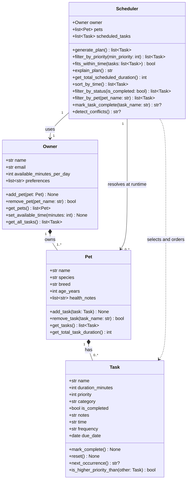

<!-- Reflects the final PawPal+ implementation — generated 2026-03-29 -->

# PawPal+ UML Class Diagram (Final)

## Part 1 — Changes from uml_draft.md to final implementation

### Task class
| What changed | Draft | Final |
|---|---|---|
| New attribute | — | `+str time` (default `"00:00"`) |
| New attribute | — | `+str frequency` (default `"once"`) |
| New attribute | — | `+date due_date` (default `date.today()`) |
| New method | — | `+next_occurrence() str?` — returns next due date string for recurring tasks, or None for one-time tasks |

### Owner class
| What changed | Draft | Final |
|---|---|---|
| New method | — | `+get_all_tasks() list~Task~` — flattens every task across all pets into one list |

### Pet class
No changes to public interface.

### Scheduler class
| What changed | Draft | Final |
|---|---|---|
| Attribute renamed + type changed | `+Pet pet` (singular, one Pet) | `+list~Pet~ pets` (plural list, populated at runtime by `generate_plan()`) |
| Constructor signature | implicitly accepted Pet | accepts only `Owner`; pets resolved at runtime via `owner.get_pets()` |
| New method | — | `+sort_by_time() list~Task~` |
| New method | — | `+filter_by_status(is_completed: bool) list~Task~` |
| New method | — | `+filter_by_pet(pet_name: str) list~Task~` |
| New method | — | `+mark_task_complete(task_name: str) str?` |
| New method | — | `+detect_conflicts() str?` |

### Relationships
| What changed | Draft | Final |
|---|---|---|
| Scheduler → Pet cardinality | `"1" --> "1" Pet : schedules for` | `"1" --> "0..*" Pet : resolves at runtime` (pets populated by `generate_plan()`, not the constructor) |

---

## Part 2 — Updated Mermaid diagram

